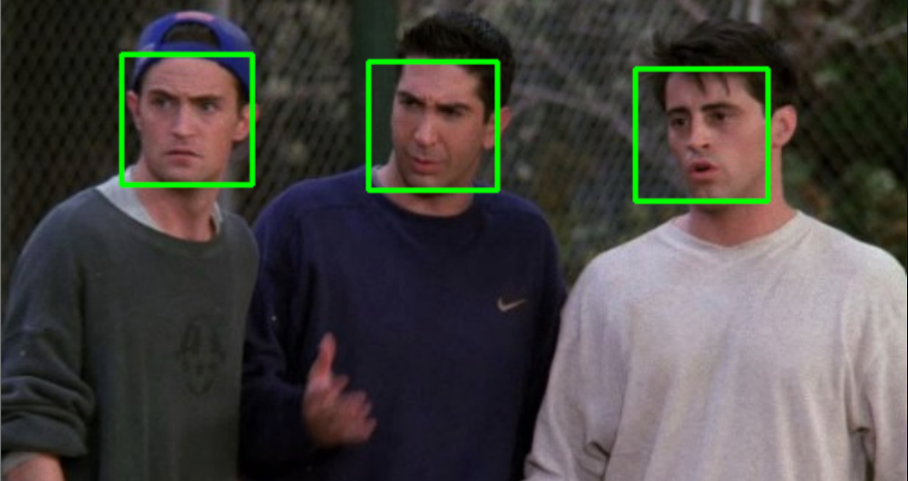

# Face Detection and Recognition App

## Introduction

Welcome to the Face Recognition and Detection App, a sophisticated tool designed to revolutionize the way we interact with images containing human faces. Leveraging cutting-edge technologies and advanced algorithms, this application offers unparalleled accuracy and efficiency in recognizing and detecting faces in various contexts.

In today's digital age, the need for robust face recognition and detection systems has become increasingly prevalent across diverse industries. From enhancing security measures to streamlining photo organization and identity verification processes, the capabilities of this app are boundless.

Powered by state-of-the-art techniques such as Principal Component Analysis (PCA), our app goes beyond simple facial recognition. It empowers users to effortlessly identify individuals within a dataset, accurately detect faces in any photo, and evaluate the performance of face recognition systems with precision.

With an intuitive user interface and seamless integration of powerful image processing libraries, the Face Recognition and Detection App sets a new standard in facial recognition technology. Whether you're a security professional, a photography enthusiast, or a researcher in the field of computer vision, this app offers invaluable functionality for your needs.

Discover the future of facial recognition with the Face Recognition and Detection App. Unleash the potential of your images and unlock a world of possibilities with just a click.

## Features

1. **Face Recognition**: Recognize faces in images based on a provided dataset. The app accurately identifies individuals present in the dataset.

2. **Face Detection**: Detect faces in any photo. The app can locate and outline faces present in the image, providing valuable insights into image content.

3. **PCA Performance Evaluation**:
   - **Accuracy**: Measure the accuracy of face recognition, indicating the proportion of correctly identified faces.
   - **Precision**: Assess the precision of face recognition, showing the proportion of correctly identified faces among the total recognized faces.
   - **Specificity**: Assess the specificity of the system, indicating the proportion of correctly identified negatives among the actual negatives.
   - **False Positive Rate**: Evaluate the rate of false positives, indicating the proportion of incorrectly identified faces among the actual negatives.
   - **True Positive Rate**: Measure the rate of true positives, showing the proportion of correctly identified faces among the actual positives.
   - **False Negative Rate**: Evaluate the rate of false negatives, indicating the proportion of incorrectly rejected faces among the actual positives.
   - **ROC Curve**: Visualize the Receiver Operating Characteristic (ROC) curve, providing insights into the trade-off between true positive rate and false positive rate.

## Technologies Used

- **Python**: The core programming language used for developing the application logic.
- **OpenCV**: Used for image processing tasks such as face detection and loading images.
- **NumPy**: Utilized for numerical computations and data manipulation, especially in PCA calculations.
- **Matplotlib**: Used for plotting ROC curves and other performance evaluation metrics.
- **PyQt5**: Employed for building the graphical user interface (GUI) of the application.

## Summary

The Face Recognition and Detection App offers advanced functionality for accurately identifying and detecting faces in images. By leveraging PCA and other techniques, it provides reliable performance evaluation metrics, ensuring the effectiveness and efficiency of face recognition systems.

## How to Run

To run the app, follow these steps:
1. Clone the repository to your local machine.
2. Install the required dependencies using `pip install -r requirements.txt`.
3. Ensure you have a dataset with labeled images for training and testing.
4. Run the main Python file `main.py` to launch the application.
5. Load an image and use the provided buttons to perform face recognition, face detection, and evaluate PCA performance.

Enjoy using the Face Recognition and Detection App for various applications such as security, photo organization, and identity verification!

   ## Contributors 

<table>
  <tr>
    <td align="center">
    <a href="https://github.com/Muhannad159" target="_black">
    
     
    <b>Muhannad Abdallah</b></a>
    </td>
  <td align="center">
    <a href="https://github.com/AliBadran716" target="_black">
    
     
    <b>Ali Badran</b></a>
    </td>
     <td align="center">
    <a href="https://github.com/ahmedalii3" target="_black">
    
     
    <b>Ahmed Ali</b></a>
    </td>
<td align="center">
    <a href="https://github.com/ossama971" target="_black">
    
     
    <b>Osama Badawi</b></a>
    </td>
      </tr>
 </table>

